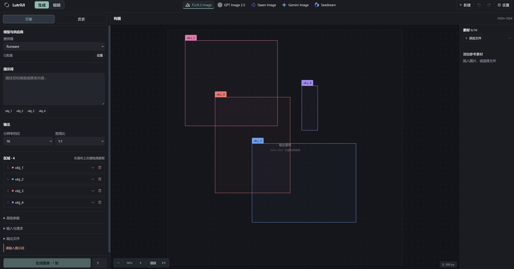

# LutriUI

基于 Tauri、React 和 TypeScript 的桌面图像生成与编辑工作台。支持 FLUX.3 Image、GPT Image 2.5、Qwen Image、Gemini Image（Nano Banana 2.1 / 2 / Pro）、Seedream 5.0（Pro / Lite / Flash）和 Grok Imagine Image 2.0，通过 OpenRouter、BFL、Comfy、Runware 或各家官方 API 调用。



## 启动

支持 Windows x64、Linux x64 和 Apple Silicon Mac。

安装 Bun、Rust 及 [Tauri 系统依赖](https://v2.tauri.app/start/prerequisites/)，然后运行：

```sh
bun install
bun run app:dev
```

## 使用

在设置中配置供应商 API Key，然后从顶部选择“生成”或“编辑”工作区，再选择模型与供应商。两个任务分别保存提示词、素材、参数和撤销记录，切换不会覆盖另一边的工作。

“生成”用于创建新画面，参考图可选；中央以网格逐张展示候选图片，点击图片可查看大图并继续编辑。FLUX 需要安排区域时再开启“区域构图”；关闭后保留区域草稿，但不会发送这些区域。Runware 的无参考图生成要求区域构图，会自动开启。

“编辑”先添加一张主图，再描述修改内容，其余素材可作为风格、主体或构图参考。

“图库”按日期显示图片网格。本机导入、粘贴或 URL 导入会复制一份到图库；每张生成结果完成后也会自动加入。可在图库中查看或复制原图、选择多张作为参考素材，或用一张图片开始编辑。工作区素材栏的“从图库选择”会按选择顺序添加图片，不重复复制图库文件；选择器内也可导入文件或粘贴图片。

删除图库图片会永久删除其原图、缩略图和图库记录，操作前需要确认。本机导入源文件、当前任务中的工作副本与生成参数记录会保留。图库使用新的独立存储，不迁移旧版数据。

- FLUX 支持区域构图与编辑；GPT Image 支持部分供应商的蒙版编辑；Qwen、Gemini Image 和 Seedream 支持多图参考与文字指令。
- Google 官方路由可控制思考级别、联网搜索、文字说明与思考摘要；结果和图库预览保留参考来源与搜索建议。
- Grok Imagine 2 支持 OpenRouter、Runware、Comfy 与 Grok 官方（`XAI_API_KEY`）；Comfy 仅文生图，其他路由支持参考图编辑。
- Google 官方使用 Gemini API Key；Seedream 官方分为火山方舟（国内）与 BytePlus（国际），密钥分别配置和保存。
- FLUX 使用鼠标右键拖拽新建包围盒，也可从已有框内部开始画新框；左键用于选择、移动和拖动手柄缩放已有框。按住空格后左键拖拽可平移视角，滚轮可缩放。
- 批次逐张显示结果；可停止后续生成，已发出的请求仍会接收并保存，未发出的请求不再计入提交。
- 生成与编辑分别保存草稿；切换模型保留提示词和素材，各模型与供应商的参数独立记忆。模型切换可撤销，不支持的区域可暂停使用，蒙版会保留并提示处理。
- 结果逐张显示，可预览、导出或继续编辑；图库管理图片，本地历史用于恢复生成配方。

`bun run dev` 仅预览界面；完整功能请运行桌面应用。模型能力与 API 差异见[架构说明](docs/architecture.md)。
