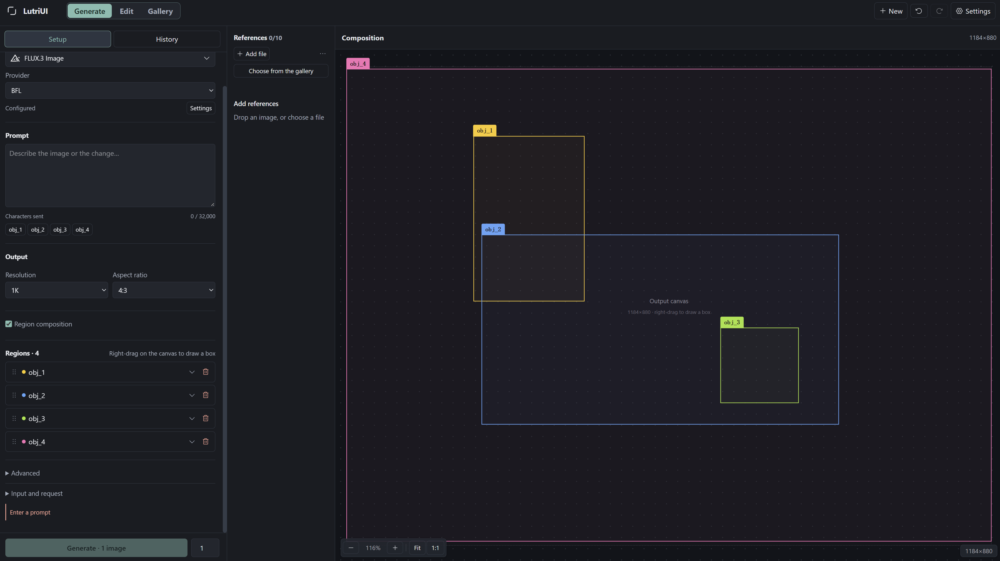

# LutriUI

基于 Tauri、React 和 TypeScript 的桌面图像生成与编辑工作台。支持 FLUX.3 Image、GPT Image 2.5、Qwen Image（3.0 / 2.1）、Gemini Image（Nano Banana 2.1 / 2 / Pro）、Seedream 5.0（Pro / Lite / Flash）和 Grok Imagine Image 2.0，通过 OpenRouter、BFL、Comfy、Runware、QwenCloud 或各家官方 API 调用。



## 启动

支持 Windows x64、Linux x64 和 Apple Silicon Mac。

安装 Bun、Rust 及 [Tauri 系统依赖](https://v2.tauri.app/start/prerequisites/)，然后运行：

```sh
bun install
bun run app:dev
```

## 使用

在设置中配置供应商 API Key，然后从顶部选择“生成”或“编辑”工作区，再选择模型与供应商。两个任务分别保存提示词、素材、参数和撤销记录，切换不会覆盖另一边的工作。

“生成”用于创建新画面，参考图可选；中央以网格逐张展示候选图片，点击图片可查看大图并继续编辑。FLUX 需要安排区域时再开启“区域构图”；关闭后保留区域草稿，但不会发送这些区域。Runware 的无参考图生成要求区域构图，会自动开启。

“编辑”先添加一张主图，再描述修改内容，其余素材可作为风格、主体或构图参考。

“图库”以等尺寸网格分页显示图片，支持搜索、来源、收藏、标签、模型和日期过滤，以及最新、最早、名称、大小排序。本机导入、粘贴或 URL 导入会复制一份到图库；每张生成结果完成后也会自动加入。可查看或复制原图、编辑名称/收藏/标签、批量导出或删除、选择多张作为参考素材，或用一张图片开始编辑。工作区素材栏的“从图库选择”会按选择顺序添加图片，不重复复制图库文件；选择器内也可导入文件或粘贴图片。

图库保存在 SQLite 数据库中，原图位于库目录内，缩略图存为库内二进制数据。可在设置中选择其他空目录作为库位置，迁移会复制并校验全部内容，原目录保留；API Key 与导出目录偏好不随库迁移。删除图库图片会永久删除其原图、缩略图和图库记录，操作前需要确认。本机导入源文件、当前任务中的工作副本与生成参数记录会保留。图库使用新的独立存储，不迁移旧版数据。设置页还提供文件检查、缩略图重建和缺失记录清理。

- FLUX 支持区域构图与编辑；GPT Image 支持部分供应商的蒙版编辑；Qwen、Gemini Image 和 Seedream 支持多图参考与文字指令。
- Google 官方路由可控制思考级别、联网搜索、文字说明与思考摘要；结果和图库预览保留参考来源与搜索建议。
- Grok Imagine 2 支持 OpenRouter、Runware、Comfy 与 Grok 官方（`XAI_API_KEY`）；Comfy 仅文生图，其他路由支持参考图编辑。
- Qwen Image 2.1 Pro 与 Turbo 使用 QwenCloud（`DASHSCOPE_API_KEY`）；2.1 Pro 也可走 Runware。参考图最多 10 张，透明背景由提示词决定。
- Google 官方使用 Gemini API Key；Seedream 官方分为火山方舟（国内）与 BytePlus（国际），密钥分别配置和保存。
- FLUX 使用鼠标右键拖拽新建包围盒，也可从已有框内部开始画新框；左键用于选择、移动和拖动手柄缩放已有框。按住空格后左键拖拽可平移视角，滚轮可缩放。
- 不同任务及批次内多张图片并发生成，逐张显示结果；可停止后续生成，已发出的请求仍会接收并保存，未发出的请求不再计入提交。
- 生成与编辑分别保存草稿；切换模型保留提示词和素材，各模型与供应商的参数独立记忆。模型切换可撤销，不支持的区域可暂停使用，蒙版会保留并提示处理。
- 结果逐张显示，可预览、导出或继续编辑；图库管理图片，本地历史用于恢复生成配方。

## MCP 智能体接入

应用内置 MCP 服务，桌面应用保持运行时，MCP 客户端可以操作当前可见的工作区草稿与图库。服务只绑定 `127.0.0.1`，默认端口 39631（设置中可改），每个请求都需携带访问令牌。

**接入步骤**

1. 在设置的“MCP”页启用服务并确认端口；端口可在运行中修改并应用。
2. 复制端点 URL 与访问令牌（令牌保存在系统凭据管理器中，仅点击“显示/复制”时读取）。客户端配置示例：

```json
{
  "mcpServers": {
    "lutriui": {
      "url": "http://127.0.0.1:39631/mcp",
      "headers": { "Authorization": "Bearer <访问令牌>" }
    }
  }
}
```

3. “轮换令牌”会使旧令牌立即失效，需更新客户端配置。

**工具工作流**

共 11 个工具，定义在 `shared/mcp-tools.json`。建议的工作流：

1. 调用 `capabilities_get` 读取模型、供应商与目标路由的完整参数模式、默认值和限制——所有可调整的供应商/模型参数都通过该模式暴露，不需要单独的参数白名单。
2. 调用 `workspace_get` 读取当前草稿、`version` 和路由能力，作为原子操作的基准。
3. `workspace_patch` 携带 `expectedVersion` 原子地修改草稿，整体作为一步撤销；版本冲突返回 `VERSION_CONFLICT`，重新读取后再试。草稿不完整时返回校验问题列表而不会失败。
4. `workspace_preview` 查看共享编译请求（图片为占位符，非供应商原生报文）后再决定是否提交。
5. `task_submit` 提交当前版本的不可变快照；提交后界面继续编辑不会影响已提交任务。该操作会调用已配置的供应商账户并可能产生费用——没有额外的付费确认机制，是否提交由客户端决定。
6. `task_get` 查询任务状态与结果资产 ID，`task_stop_remaining` 仅停止尚未发出的请求。
7. `gallery_query` / `gallery_read` / `gallery_import` 直接操作图库；图片始终以资产 ID 引用，没有文件路径或任意文件系统访问。

**幂等与计数**

- `repeatCount` 是批次数（1–20 个独立单图请求）；路由参数里的原生 `count` 固定为 1。
- `task_submit` 的 `idempotencyKey` 是 UUID，记录在持久化账本中；不确定的重试使用完全相同的 key 与 `expectedVersion`，返回原任务而不会重复计费，应用重启后仍然有效。同一 key 配不同版本会返回 `IDEMPOTENCY_CONFLICT`。

**约束**

- 桌面应用必须保持运行；关闭应用后服务与共享工作区同时结束。这不是独立守护进程，也不附带 MCP 客户端。
- 服务不暴露供应商凭据、应用设置或文件系统路径；凭据始终保存在系统凭据管理器中。

`bun run dev` 仅预览界面；完整功能请运行桌面应用。模型能力与 API 差异见[架构说明](docs/architecture.md)。
